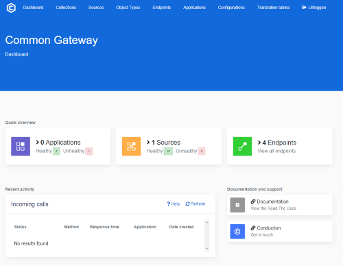

# Getting started

The Common Gateway is designed to be developer-friendly, providing a local development environment is an essential part of that experience. Since the Common Gateway is developed [Kubernetes first](https://kubernetes.io/docs/tutorials/kubernetes-basics/) we will assume that you have [Docker Desktop](https://docs.docker.com/desktop/) installed. If you want to play around with the API we also recommend using [Postman](https://www.postman.com/downloads/) or running a local application through [Node.js](https://nodejs.org/en/download/)
__________________________________________________________________________________________________________

## Basic setup

_________________________________________________________________________________________________________

The Common Gateway supplies a (progressive) web-based app, or PWA, with an AJAX endpoint that handles all the application's actions. In other words, it's the engine under your application. The gateway itself doesn't provide an interface. You can, however, also deploy the getaways dashboard. To handle and store information, the gateway will also need a database, additionally, it uses a separate NGINX container to service web traffic (you can read a bit more about the why under security). Generally speaking, this means that your local setup would look something like this.

Okay, that might sound a bit complex, but keep in mind that containers are just Kubernetes slang for virtual machines, and volumes are comparable to drives. Fortunately, Docker Desktop handles all the complexities of this setup, so let's take a look at getting it all up and running.
__________________________________________________________________________________________________________

## Spinning up the gateway

__________________________________________________________________________________________________________
As a Kubernetes open-source software project, all the Gateway's images are publicly available for download, this means that we don't need to build any code locally. We simply tell Docker Desktop to pull the images, connect them, attach volumes and spin them up.

This is done through a `docker-compose` file (example below). The latest version is pulled automatically with your repository.

```yaml
version: '3.5'

x-cache:
  &cache
  cache_from:
    - ${CONTAINER_REGISTRY_BASE}/${CONTAINER_PROJECT_NAME}-php
    - ${CONTAINER_REGISTRY_BASE}/${CONTAINER_PROJECT_NAME}-nginx

services:
  #  gateway-frontend:
  #    &gateway-frontend
  #    image: ghcr.io/conductionnl/commonground-gateway-frontend:latest
  #    depends_on:
  #      - php
  #    ports:
  #      - "83:80"
  php:
    &php
    image: ${CONTAINER_REGISTRY_BASE}/${CONTAINER_PROJECT_NAME}-php:${APP_ENV}
    build:
      context: ./api
      target: api_platform_php
      <<: *cache
    depends_on:
      - db
    volumes:
      - ./api:/srv/api:rw,cached
      - ./api/var/certs:/var/certs:rw,cached
      - ./gateway:/srv/api/fixtures:rw,cached
    environment:
      - CONTAINER_REGISTRY_BASE=${CONTAINER_REGISTRY_BASE}
      - CONTAINER_PROJECT_NAME=${CONTAINER_PROJECT_NAME}
      #- DATABASE_URL=postgres://api-platform:!ChangeMe!@db/api?serverVersion=10.1
      - DATABASE_URL=mysql://api-platform:!ChangeMe!@db/api?serverVersion=10.1
      - APP_ENV=${APP_ENV}
      - APP_CONTAINER=${APP_CONTAINER}
      - APP_DEBUG=${APP_DEBUG}
      - APP_CACHE=${APP_CACHE}
      - APP_VERSION=${APP_VERSION}
      - APP_NAME=${APP_NAME}
      - APP_NAME_TECHNICAL=${APP_NAME_TECHNICAL}
      - APP_DOMAIN=${APP_DOMAIN}
      - APP_SUBDOMAIN=${APP_SUBDOMAIN}
      - APP_SUBPATH=${APP_SUBPATH}
      - APP_SUBPATH_ROUTING=${APP_SUBPATH_ROUTING}
      - APP_DEMO=${APP_DEMO}
      - APP_REPRO=${APP_REPRO}
      - APP_DESCRIPTION=${APP_DESCRIPTION}
      - APP_LOGO=${APP_LOGO}
      - APP_HOME=${APP_HOME}
      - APP_COMMONGROUND_ID=${APP_COMMONGROUND_ID}
      - APP_APPLICATION_KEY=${APP_APPLICATION_KEY}
      - APP_BUILD_ALL_FIXTURES=${APP_BUILD_ALL_FIXTURES}
      - APP_WEB=${APP_WEB}
      - BADGES=${BADGES}
      - APP_BUILD=${APP_BUILD}
      - APP_INTERNAL=${APP_INTERNAL}
      - APP_URL=${APP_URL}
      - APP_CHART=${APP_CHART}
      - HELM_REPOSITORY=${HELM_REPOSITORY}
      - ARTIFACTHUB_ID=${ARTIFACTHUB_ID}
      - ARTIFACTHUB_USER=${ARTIFACTHUB_USER}
      - OWNER_NAME=${OWNER_NAME}
      - OWNER_URL=${OWNER_URL}
      - APP_SESSION_DURATION=${APP_SESSION_DURATION}
      - LICENCE_NAME=${LICENCE_NAME}
      - TRUSTED_PROXIES=${TRUSTED_PROXIES}
      - TRUSTED_HOSTS=${TRUSTED_HOSTS}
      - AUTH_ENABLED=${AUTH_ENABLED}
      - AUDITTRAIL_ENABLED=${AUDITTRAIL_ENABLED}
      - NOTIFICATION_ENABLED=${NOTIFICATION_ENABLED}
      - DIGID_ARTIFACT_URL=${DIGID_ARTIFACT_URL}
      - REDIS_HOST=redis
      - REDIS_PORT=6379
      - APP_AUTH=${APP_AUTH}
    ports:
      - "82:80"

  api:
    &nginx
    image: ${CONTAINER_REGISTRY_BASE}/${CONTAINER_PROJECT_NAME}-nginx:${APP_ENV}
    build:
      context: ./api
      target: api_platform_nginx
      dockerfile: Dockerfile-nginx
      <<: *cache
    depends_on:
      - php
    volumes:
      - ./api/public:/srv/api/public:ro
    ports:
      - "80:80"
    environment:
      - NGINX_HOST=php
      - NGINX_ENV=${APP_ENV}

  # helmPackage:
  #   image: alpine/helm:3.2.1
  #   volumes:
  #     - ./api/helm:/apps
  #   command: package /apps

  # helmIndex:
  #   depends_on:
  #     - helmPackage
  #   image: alpine/helm:3.2.1
  #   volumes:
  #     - ./api/helm:/apps
  #   command: repo index /apps

  redis:
    image: redis:4-alpine

  db:
    image: mysql:5.7
    environment:
      - MYSQL_ROOT_PASSWORD=example
      - MYSQL_DATABASE=api
      - MYSQL_USER=api-platform
      - MYSQL_PASSWORD=!ChangeMe!
    volumes:
      - db-mysql:/var/lib/mysql:rw
    ports:
      - "3366:3306"

networks:
  nlx:
    name: nlx

volumes:
  db-data: {}
  db-mysql: {}
  nlx-data-2: {}
```

You can download this file to any directory on your computer, open up your [command line tool](https://www.google.com/search?q=command+line+tool) or shell, and tell Docker to start your containers with the `docker-compose up` command from the folder you just downloaded the yaml file to.

```cli
docker-compose up
```

You will see the containers (virtual machines) come up one by one. Wait until all reports are done and a `ready to handle connections` message appears. Open your Docker Desktop to verify all containers are up and running.

Alternatively, you can spin up the frontend from [this repository](https://github.com/ConductionNL/commonground-gateway-frontend) and have a GUI along with the Gateway engine.  
  
.

The login is:

login: `test@gateway.local`  
password: `!ChangeMe!`  

__________________________________________________________________________________________________________

## Creating you first objects

__________________________________________________________________________________________________________

Now that we have our Web Gateway up and running, let's start by creating some objects to turn it into a working API. The Web Gateway supports three different ways of [configuring]().
